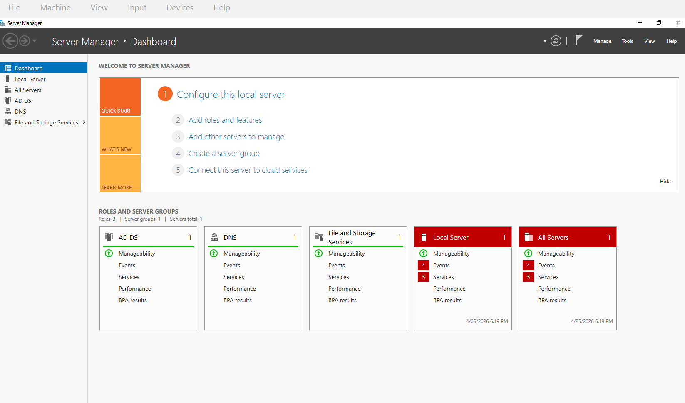
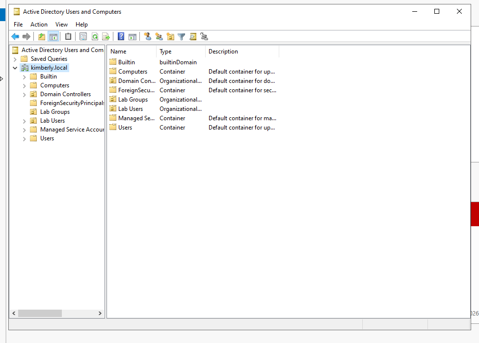
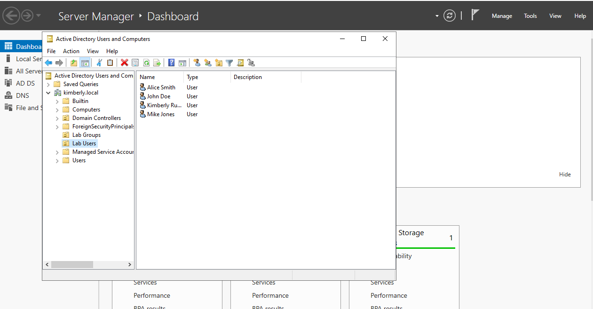
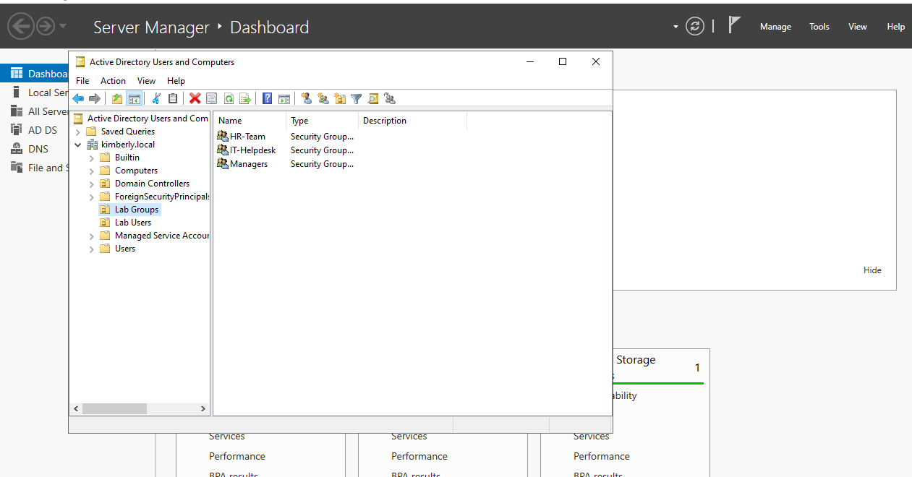
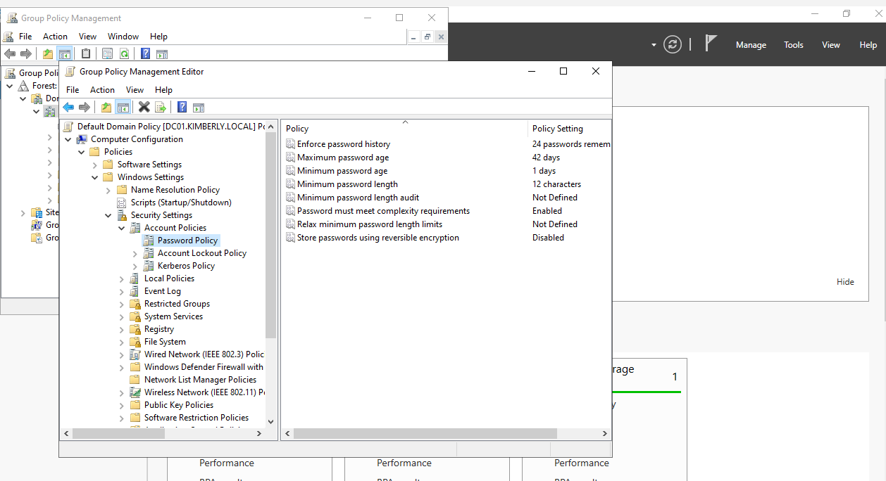
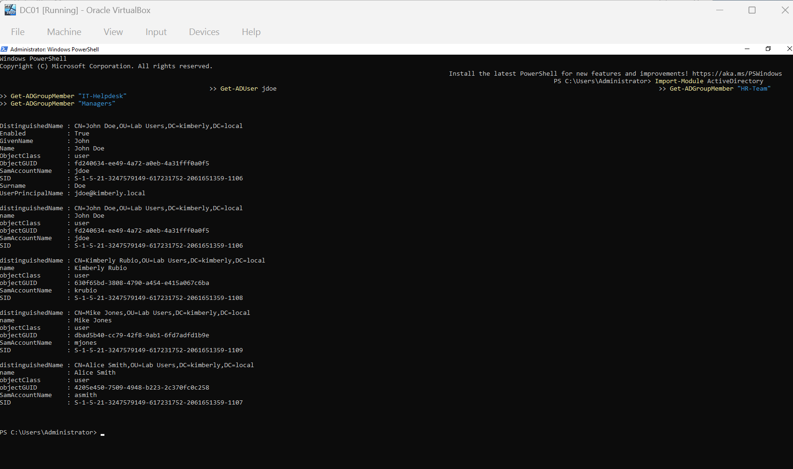

# Active Directory HomeLab

## Overview
Built a Windows Server 2022 Active Directory lab using Oracle VirtualBox.

## Environment
- Oracle VirtualBox
- Windows Server 2022
- Active Directory Domain Services
- DNS
- PowerShell
- Group Policy

## Tasks Completed
- Installed Windows Server 2022
- Promoted server to Domain Controller
- Created domain: kimberly.local
- Created Organizational Units
- Added users and groups
- Applied password policy
- Verified users/groups with PowerShell

## Skills Learned
- Windows Server Administration
- Active Directory Management
- Group Policy
- PowerShell
- Troubleshooting
- Identity and Access Management

## Project Screenshots

### Server Manager Dashboard

### Active Directory Structure

### Users Created

### Security Groups

### Password Policy

### PowerShell Verification

## Key Takeaways
- Gained hands-on experience with Active Directory user and group management
- Learned how to apply and verify Group Policy settings
- Practiced using PowerShell to query and validate AD objects
- Built foundational skills in identity and access management
